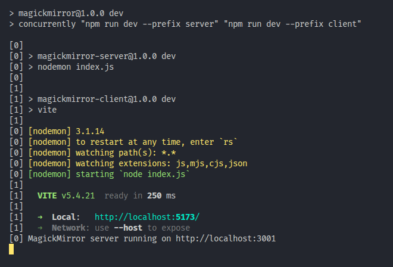
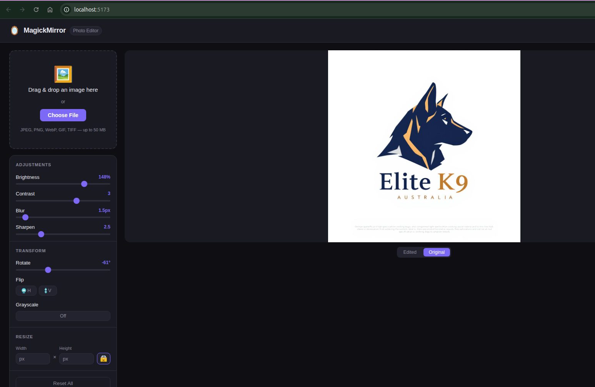
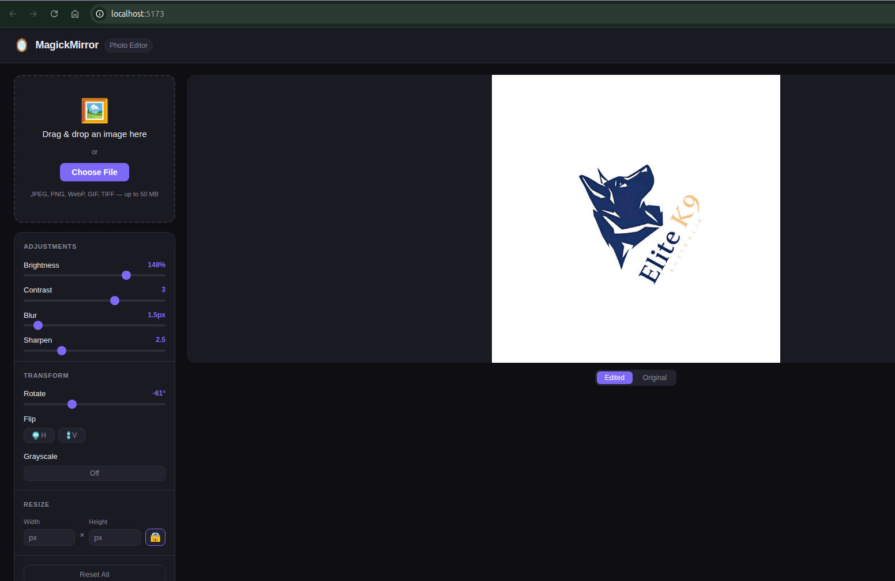

Task ID: 52886db9-e8a7-4bca-b550-e79a24387bfe

# 🪄 MagickMirror

**MagickMirror** is a high-performance photo editing suite built with **React** and **Node.js**. It leverages the power of **ImageMagick** on the backend to provide professional-grade image transformations through a sleek, real-time user interface.

## 🚀 Features

* **Real-time Previews:** 250ms debounced transforms ensure a responsive editing experience without overloading the server.
* **Comprehensive Toolkit:**
* **Adjustments:** Brightness, Contrast, Grayscale.
* **Filters:** Blur, Sharpen.
* **Geometry:** Rotate (-180° to 180°), Flip (Horizontal/Vertical), and Aspect-Locked Resizing.


* **Smart Uploads:** Drag-and-drop support with immediate metadata retrieval.
* **Flexible Export:** Edit in one format, download in another (supports JPEG, PNG, and more).

---

## 🛠️ Tech Stack

| Layer | Technology |
| --- | --- |
| **Frontend** | React, Vite, CSS3 |
| **Backend** | Node.js, Express |
| **Processing** | ImageMagick (`gm` library) |
| **Testing** | Playwright (End-to-End) |

---

## 📂 Project Structure

```text
MagickMirror/
├── server/                 # Express API & Image Processing
│   ├── routes/             # REST Endpoints (Upload/Transform/Download)
│   ├── services/           # ImageMagick logic (gm chain)
│   └── tmp/                # Local buffer for active edits
├── client/                 # React Frontend (Vite)
│   ├── src/api/            # Blob lifecycle & Fetch wrappers
│   └── src/components/     # UI Library (Canvas, Toolbar, Uploader)
└── tests/                  # Playwright Test Suite

```

---

## 🚥 Getting Started

### Prerequisites

* **Node.js** (v18+ recommended)
* **ImageMagick** installed on your system (Required for backend processing).

### Installation

1. Clone the repository.
```bash
git clone https://github.com/polycarpmotachi-hub/MagickMirror.git

```
2. Install dependencies for both client and server:
```bash
npm install

```


### Development

Start the concurrent development environment (Client on `:5173`, Server on `:3001`):

```bash
npm run dev

```






### Testing

Run the Playwright E2E suite to verify upload, transformation, and download flows:

```bash
npm test

```

---

## 🧪 Verified Workflows

The following "Smoke Tests" are fully passing:

* ✅ **Upload:** Successfully returns image metadata.
* ✅ **Transform:** Server returns processed JPEG buffers.
* ✅ **Download:** Format selector correctly exports files as PNG.

---

> **Note:** This project uses a `tmp/` directory for processing. These files are automatically ignored by git and handled by the `imageApi` lifecycle to keep the server lightweight.

